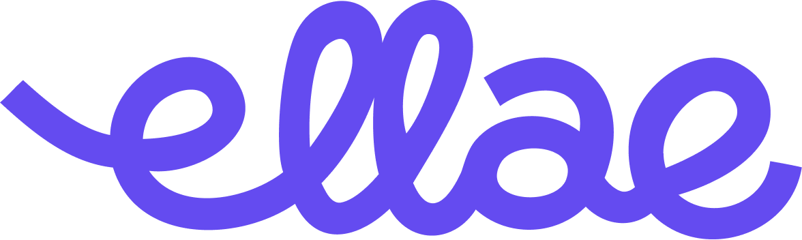
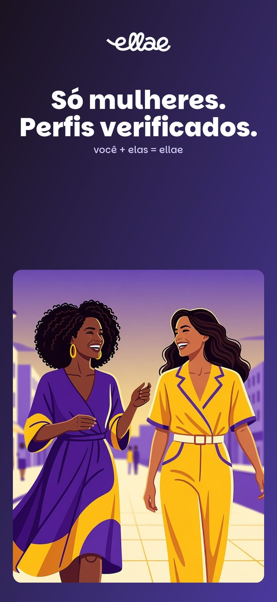
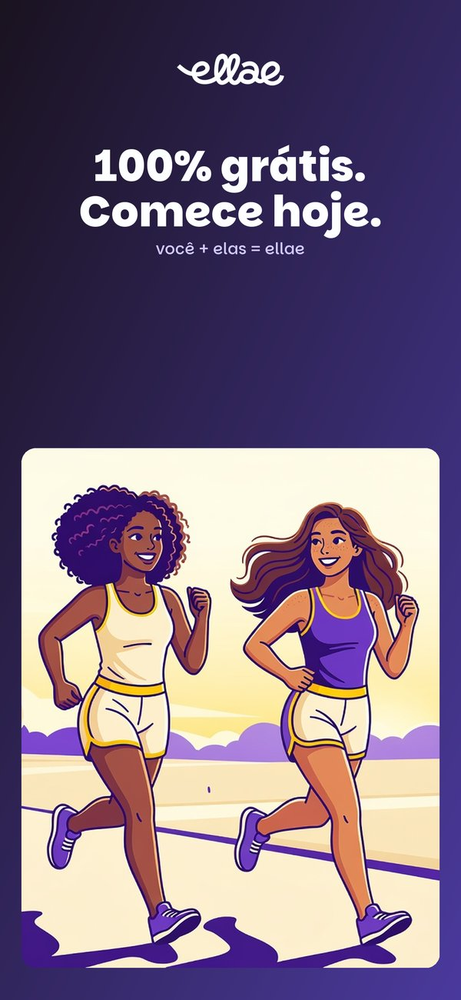

# Ellae

### Você não precisa mais sair sozinha.

**A rede social feita só para mulheres — pra conhecer gente perto de você e sair com segurança, na vida real.**

*você + elas = ellae*

**[ellae.app](https://ellae.app)**

---

Fazer amizade de verdade depois de adulta é difícil. Mudou de cidade, a rotina fechou o ciclo, as amigas ficaram longe — e sair sozinha nem sempre parece seguro. O Ellae existe pra resolver exatamente isso: um lugar **só de mulheres** pra encontrar quem mora perto de você, combinar um café, um jantar, uma roda de conversa ou um rolê, e ir **acompanhada**.

Não é app de paquera. Não é chat infinito. É amizade e encontro presencial entre mulheres — com segurança no centro de tudo.

## Por que o Ellae é diferente

- **Segurança em primeiro lugar** — comunidade **exclusiva para mulheres**, com **perfis verificados** e verificação de identidade no cadastro. Denúncia, bloqueio e moderação ativa fazem parte do app, não são detalhe.
- **Gente perto de você** — descubra mulheres na sua cidade e no seu ritmo. O valor do Ellae é a vizinhança: amizades que cabem no seu dia a dia.
- **Encontros de verdade** — crie e participe de encontros presenciais do seu jeito: café, jantar, rolê, roda de conversa. O app te ajuda a sair da tela pro mundo real.
- **Comunidade acolhedora** — um espaço leve, feminino e sem corporativês, feito pra pertencer. Aqui você não precisa mais sair sozinha.
- **100% grátis pra começar** — baixe, verifique seu perfil e comece hoje.

## Como funciona

1. **Baixe o Ellae** e crie seu perfil.
2. **Verifique sua identidade** — é o que mantém a comunidade só de mulheres e confiável.
3. **Encontre mulheres perto de você** e veja os encontros na sua cidade.
4. **Combine ou crie um encontro** — e vá acompanhada.

## Conheça o app

## Baixar

- **iPhone (iOS):** [disponível na App Store](https://apps.apple.com/br/app/ellae/id6762098223)
- **Android:** chegando ao Google Play — acompanhe em **[ellae.app](https://ellae.app)**

## Sobre

O Ellae nasceu em **Porto Velho (RO)** com uma ideia simples e teimosa: amizade adulta é possível, e mulher nenhuma deveria deixar de sair por medo de sair sozinha. Desde então virou um app cuidado nos detalhes — verificação, moderação e uma comunidade que se protege — pensado por e para mulheres brasileiras.

Desenvolvido por **Paulo**, desenvolvedor indie brasileiro, com uma identidade de marca própria (design **KR8**) e obsessão por fazer o simples funcionar bem. É software de gente pequena feito com padrão de gente grande.

## Marca

- **Identidade:** KR8 Hub — dueto **roxo (#644BF0)** + **amarelo (#FFE000)**, sobre fundos claros e cremes.
- **Tipografia:** Parkinsans (títulos) + Nunito (texto).
- **Tom de voz:** acolhedor, direto, feminino. Sem corporativês.

---

**[ellae.app](https://ellae.app)** · [App Store](https://apps.apple.com/br/app/ellae/id6762098223) · [paulobatista19988@proton.me](mailto:paulobatista19988@proton.me)

*você + elas = ellae*

